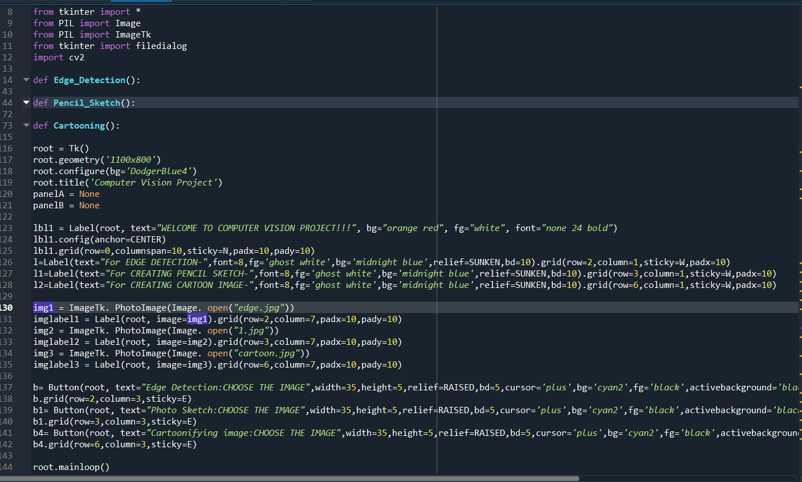
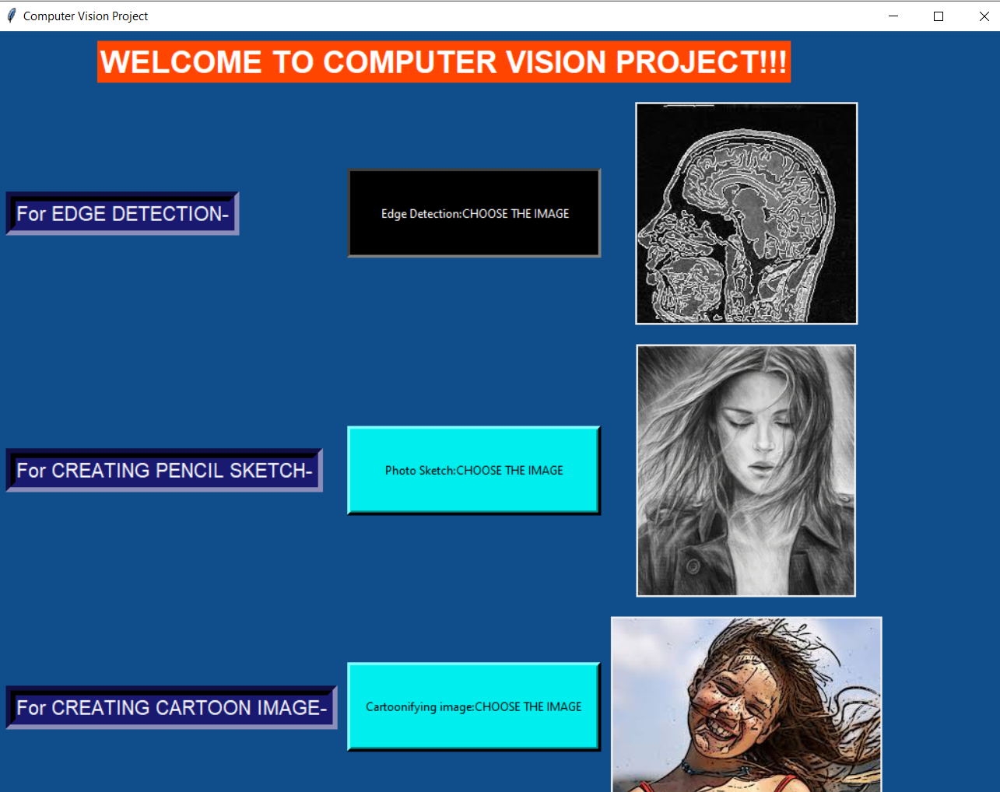
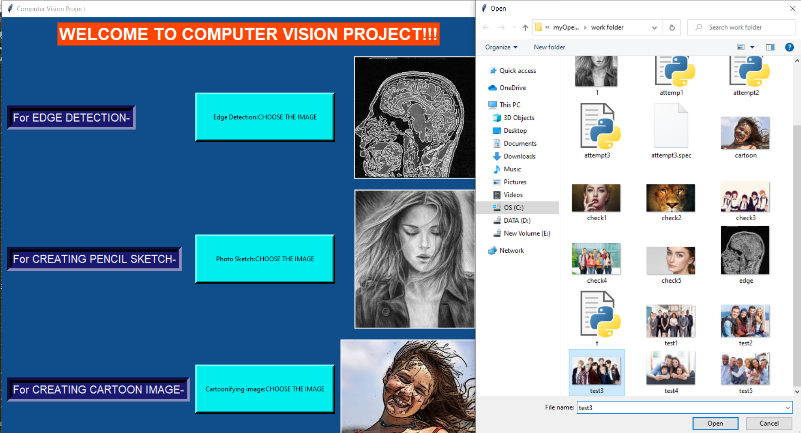
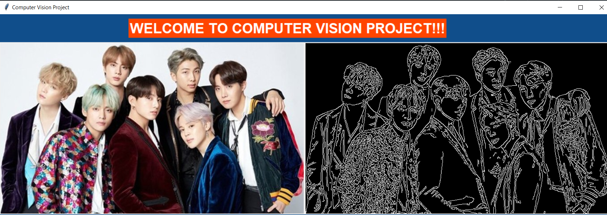

# Image-filters-using-OpenCV-
The project comes under Computer Vision. The library used is OpenCV. This project makes the user choose any image from one's system and process it using the specific filter chosen. It contains 3 filters namely **Edge Detection, Pencil Sketch, Cartooning Effect**.

**_Edge detection_** 
                 The Python opencv library is mostly preferred for computer vision tasks. You can detect all the edges of different objects of the image.
                 
**_Pencil Sketch_**                
                Computer vision can be used to process images and perform various transformations on the image. The idea is to build an user friendly interface that will take an image as input from the user and convert it into a pencil sketching.
                
**_Cartooning Effect_**
                   In this part, we built an interface to upload the image on the project and then by performing different transformations on the image we can make the image look like a cartoon.
                   
_Here is the code snippet for the described project_

_Here is the window which appeared after executing the code, made using Tkinter library python._

Now, When the user will press any button amongst the 3 buttons, the file choose dialog box will appear where the user will be asked to choose any image from his system.
   

Then the image inputted to the interface will be filtered as per the option chosen:
1. _EDGE DETECTION_

2. _PENCIL SKETCH EFFECT_

3. _CARTOONING EFFECT_

